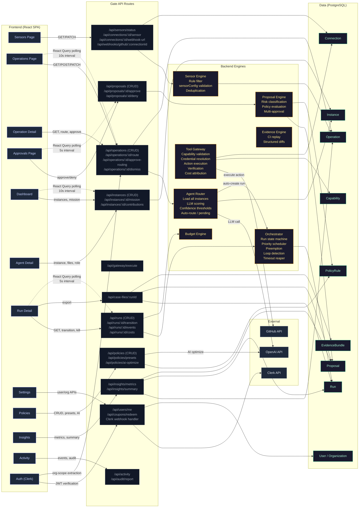

# Wooblay Architecture Diagrams — Miro-Ready

Three comprehensive Mermaid diagrams covering the entire Wooblay system.
Paste each diagram into Miro's Mermaid widget for instant visual reproduction.

---

## Diagram 1: Full Technical Architecture

```mermaid
flowchart TB
    subgraph External["External Systems"]
        GH_IN["GitHub Webhooks<br/>(push, PR, check_run)"]
        GH_API["GitHub API<br/>(PR, files, checks)"]
        CLERK["Clerk Auth<br/>(JWT, Orgs, Webhooks)"]
        OPENAI["OpenAI API<br/>(Routing, Analysis)"]
        BROWSER["User Browser<br/>(React SPA)"]
    end

    subgraph Edge["Edge / Infrastructure"]
        ALB["ALB / Route53<br/>TLS Termination"]
    end

    subgraph Gate["Gate API Server (Fastify)"]
        subgraph Middleware["Middleware Layer"]
            CLERK_AUTH["Clerk JWT Auth<br/>clerk-auth.ts"]
            ORG_SCOPE["Org Scope Isolation<br/>org-scope.ts"]
            RATE_LIMIT["Rate Limiting<br/>rate-limit.ts"]
            AGENT_AUTH["Agent Signature Auth<br/>auth.ts"]
        end

        subgraph Routes["API Routes"]
            OP_ROUTES["Operation Routes<br/>/api/operations (CRUD)<br/>/api/operations/:id/route<br/>/api/operations/:id/approve-routing"]
            SENSOR_ROUTES["Sensor Routes<br/>/api/webhooks/github/:connectionId<br/>/api/sensors/status<br/>/api/connections/:id/sensor<br/>/api/connections/:id/webhook-url"]
            RUN_ROUTES["Run Routes<br/>/api/runs (CRUD)<br/>/api/runs/:id/transition<br/>/api/runs/:id/kill"]
            PROPOSAL_ROUTES["Proposal Routes<br/>/api/proposals (CRUD)<br/>/api/proposals/:id/approve<br/>/api/proposals/:id/deny"]
            GW_ROUTES["Gateway Routes<br/>/api/gateway/execute<br/>Capability token validation"]
            CONN_ROUTES["Connection Routes<br/>/api/connections (CRUD)"]
            INSTANCE_ROUTES["Instance Routes<br/>/api/instances (CRUD)<br/>/api/instances/:id/mission"]
            USER_ROUTES["User Routes<br/>/api/users/me<br/>Clerk webhook sync"]
            OTHER_ROUTES["Other Routes<br/>insights, case-file,<br/>policies, activity, audit"]
        end

        subgraph Engine["Core Engines"]
            SENSOR_ENGINE["Sensor Engine<br/>sensor.ts<br/>Rule filter + dedup<br/>sensorConfig validation"]
            AI_EVAL["AI Evaluation<br/>router.ts<br/>LLM scoring of agents<br/>Confidence thresholds"]
            ORCHESTRATOR["Orchestrator<br/>orchestrator.ts<br/>Run state machine<br/>Deterministic IDs<br/>Loop detection<br/>Timeout reaper"]
            PROPOSAL_ENGINE["Proposal Engine<br/>Risk classification<br/>Evidence bundles<br/>Policy evaluation"]
            TOOL_GATEWAY["Tool Gateway<br/>gateway.ts<br/>Capability token validation<br/>Credential resolution<br/>Action execution<br/>Post-action verification<br/>Cost attribution<br/>Idempotency cache"]
            BUDGET["Budget Engine<br/>budget.ts<br/>cost-attribution.ts"]
            EVIDENCE["Evidence Engine<br/>evidence.ts<br/>CI replay recipes<br/>Structured diffs"]
        end

        subgraph Security["Security Layer"]
            CAP_TOKENS["Capability Tokens<br/>Ed25519 signed<br/>15-min TTL<br/>Scoped per action"]
            ENVELOPE_ENC["Envelope Encryption<br/>AES-256-GCM<br/>DEK/KEK pattern"]
            WEBHOOK_VERIFY["Webhook Verification<br/>HMAC-SHA256 (GitHub)<br/>Svix (Clerk)<br/>Per-connection secrets"]
            KEY_ROTATION["Key Rotation<br/>WOOBLAY_SERVER_KEY_ID<br/>Previous keys for verify"]
        end
    end

    subgraph Data["Data Layer"]
        PG["PostgreSQL via Prisma"]
        subgraph Models["Core Models"]
            M_OP["Operation<br/>(@@map Incident)<br/>routing fields"]
            M_RUN["Run<br/>operationId<br/>state machine"]
            M_CONN["Connection<br/>sensorEnabled<br/>sensorConfig<br/>webhookSecret"]
            M_INST["Instance<br/>role, inferredRole<br/>containerId"]
            M_PROP["Proposal<br/>riskClass<br/>policySnapshot"]
            M_CAP["Capability<br/>actionClass, scope<br/>usedCount/maxUses"]
            M_EB["EvidenceBundle<br/>reproducible<br/>structuredDiff"]
            M_POLICY["PolicyRule<br/>orgId, instanceId<br/>matchTool, decision"]
            M_COST["RunCost<br/>category, amountCents"]
            M_LEASE["SecretLease<br/>connectionId, scopes"]
            M_WH["WebhookDelivery<br/>deliveryId (dedup)"]
            M_ORG["Organization<br/>Clerk org sync"]
            M_USER["User<br/>clerkId, orgId, role"]
        end
    end

    subgraph AgentContainer["Agent Container"]
        OPENCLAW["OpenClaw Runtime"]
        SOUL["SOUL.md / IDENTITY.md"]
        WORKSPACE["Workspace Filesystem"]
        TG_CLIENT["TG Client<br/>Talks to Tool Gateway"]
    end

    subgraph Infra["Infrastructure"]
        DOCKER["Docker<br/>gate + agent images"]
        ECR["ECR Registry"]
        EC2["EC2 Compute"]
        RDS["RDS PostgreSQL"]
        KMS["AWS KMS"]
        SM["Secrets Manager"]
        GH_ACTIONS["GitHub Actions CI/CD"]
    end

    %% External flows
    GH_IN -->|"webhook POST"| ALB
    BROWSER -->|"HTTPS"| ALB
    CLERK -->|"webhook POST"| ALB
    ALB --> CLERK_AUTH
    CLERK_AUTH --> ORG_SCOPE
    ORG_SCOPE --> RATE_LIMIT

    %% Webhook flow
    RATE_LIMIT --> SENSOR_ROUTES
    SENSOR_ROUTES --> SENSOR_ENGINE
    SENSOR_ENGINE -->|"rule filter"| AI_EVAL
    AI_EVAL -->|"route operation"| ORCHESTRATOR
    AI_EVAL -->|"LLM call"| OPENAI
    SENSOR_ENGINE -->|"create Operation"| PG

    %% User API flow
    RATE_LIMIT --> OP_ROUTES
    RATE_LIMIT --> RUN_ROUTES
    RATE_LIMIT --> PROPOSAL_ROUTES
    RATE_LIMIT --> GW_ROUTES
    RATE_LIMIT --> INSTANCE_ROUTES
    RATE_LIMIT --> USER_ROUTES
    RATE_LIMIT --> OTHER_ROUTES

    OP_ROUTES --> PG
    RUN_ROUTES --> ORCHESTRATOR
    ORCHESTRATOR --> PG
    PROPOSAL_ROUTES --> PROPOSAL_ENGINE
    PROPOSAL_ENGINE --> PG

    %% Gateway flow
    GW_ROUTES --> TOOL_GATEWAY
    TOOL_GATEWAY --> CAP_TOKENS
    TOOL_GATEWAY -->|"resolve creds"| ENVELOPE_ENC
    TOOL_GATEWAY -->|"execute action"| GH_API
    TOOL_GATEWAY --> BUDGET
    TOOL_GATEWAY --> PG

    %% Agent flow
    TG_CLIENT -->|"capability token"| GW_ROUTES
    OPENCLAW --> TG_CLIENT

    %% Security
    WEBHOOK_VERIFY -.-> SENSOR_ROUTES
    WEBHOOK_VERIFY -.-> USER_ROUTES

    %% Infrastructure
    DOCKER --> EC2
    EC2 --> RDS
    ENVELOPE_ENC -.-> KMS
    ENVELOPE_ENC -.-> SM

    %% Org isolation boundary
    style ORG_SCOPE fill:#1a1a2e,stroke:#818cf8,stroke-width:2px

    classDef external fill:#1e293b,stroke:#64748b,color:#e2e8f0
    classDef engine fill:#1a1a2e,stroke:#818cf8,color:#c7d2fe
    classDef security fill:#1a1a2e,stroke:#f59e0b,color:#fde68a
    classDef data fill:#1a1a2e,stroke:#10b981,color:#a7f3d0

    class GH_IN,GH_API,CLERK,OPENAI,BROWSER external
    class SENSOR_ENGINE,AI_EVAL,ORCHESTRATOR,PROPOSAL_ENGINE,TOOL_GATEWAY,BUDGET,EVIDENCE engine
    class CAP_TOKENS,ENVELOPE_ENC,WEBHOOK_VERIFY,KEY_ROTATION security
    class PG,M_OP,M_RUN,M_CONN,M_INST,M_PROP,M_CAP,M_EB,M_POLICY,M_COST,M_LEASE,M_WH,M_ORG,M_USER data
```



---

## Diagram 2: Full UX Flow

```mermaid
flowchart TB
    subgraph Auth["Authentication"]
        LANDING["Landing Page"]
        SIGN_IN["Clerk Sign In"]
        SIGN_UP["Clerk Sign Up"]
        ORG_SELECT["Organization Selection<br/>OrganizationSwitcher"]
        ORG_CREATE["Create Organization"]
    end

    subgraph Onboarding["Onboarding"]
        COUPON["Coupon Activation<br/>WOOBLAY-BETA-2026"]
        FIRST_SETUP["First-Time Setup"]
    end

    subgraph Sidebar["Sidebar Navigation"]
        direction TB
        NAV_OPERATE["OPERATE<br/>Operations (badge: count)<br/>Approvals (badge: count)"]
        NAV_CONFIGURE["CONFIGURE<br/>Sensors<br/>Policies"]
        NAV_OBSERVE["OBSERVE<br/>Insights<br/>Activity<br/>Dashboard"]
        NAV_SETTINGS["Settings"]
    end

    subgraph SensorsFlow["Sensors Page (/sensors)"]
        SENSOR_LIST["View All Sensors<br/>Name, provider, status<br/>Toggle on/off<br/>24h operation count"]
        ADD_SENSOR["Add GitHub Sensor<br/>Name + PAT<br/>Auto-init sensorConfig"]
        SENSOR_EXPAND["Expanded Panel<br/>├ Webhook URL (copy)<br/>├ Webhook Secret (copy)<br/>├ GitHub setup instructions<br/>└ Sensor config:"]
        SENSOR_CONFIG["Config Panel<br/>├ Watch events (toggles)<br/>├ Branch filter<br/>├ Ignore drafts<br/>├ Ignore bots<br/>└ Auto-create run"]
        TEST_CONN["Test Connection"]
        REVOKE_CONN["Revoke Connection"]
    end

    subgraph OpsFlow["Operations Page (/operations)"]
        OP_LIST["View All Operations<br/>Active / Resolved tabs<br/>Priority, intent, status<br/>Routing status per row"]
        OP_ROUTING["Routing Status Indicators<br/>● Green: auto-routed<br/>● Amber: pending approval<br/>● Grey: unassigned"]
        OP_INLINE_APPROVE["Inline Routing Approval<br/>Approve [AgentName]<br/>Assign to...<br/>Dismiss"]
        OP_FILTER["Filter by status,<br/>priority, intent"]
        CREATE_MANUAL["Create Manual Operation"]
    end

    subgraph OpDetail["Operation Detail (/operations/:id)"]
        OP_META["Operation Metadata<br/>Repo, branch, commit<br/>Sensor source"]
        OP_ROUTING_SECTION["Routing Section<br/>Assigned agent + confidence<br/>AI reason<br/>Approve / Reassign / Dismiss"]
        OP_RUNS["Runs List<br/>Status, attempt, budget"]
        OP_CREATE_RUN["Create New Run"]
        OP_RESOLVE["Resolve / Close"]
        OP_TIMELINE["Timeline<br/>Created, routed, runs"]
    end

    subgraph RunDetail["Run Detail (/runs/:id)"]
        RUN_HEADER["Run Header<br/>Status, priority, budget<br/>Pause / Resume / Kill"]
        RUN_PROPOSALS["Proposals<br/>Action class, risk, status<br/>Approve / Deny<br/>Policy snapshot<br/>Rollback button"]
        RUN_EVIDENCE["Evidence Bundles<br/>Recipe, status, diff<br/>Re-run button"]
        RUN_VERIFY["Verification Summary<br/>Passed / Failed / Skipped"]
        RUN_TIMELINE["Timeline Events<br/>State changes, tool calls"]
        RUN_BUDGET["Budget Tracking<br/>Spent vs limit"]
        CASE_FILE["Export Case File"]
    end

    subgraph ApprovalsFlow["Approvals Page (/approvals)"]
        APPROVAL_LIST["Pending Action Approvals<br/>From agent proposals"]
        APPROVE_DENY["Approve / Deny<br/>with context"]
        RISK_DISPLAY["Risk Tier Display<br/>low/medium/high/critical"]
    end

    subgraph DashboardFlow["Dashboard (/)"]
        AGENT_CARDS["Agent Cards<br/>Face, trust, weather<br/>Start / Stop / Restart<br/>Inline deploy<br/>Cost tracking"]
    end

    subgraph AgentDetail["Agent Detail (/instances/:id)"]
        AGENT_OVERVIEW["Overview Tab<br/>Trust score, cost<br/>Actions, contribution<br/>Network graph"]
        AGENT_PROFILE["Profile Tab<br/>SOUL.md, role, goal<br/>IDENTITY.md"]
        AGENT_ACCESS["Access Tab<br/>⚠ Risk Warning Banner<br/>Direct credentials<br/>(bypasses TG)"]
        AGENT_WORKSPACE["Workspace Tab<br/>File explorer<br/>Read / Edit / Download"]
    end

    subgraph SettingsFlow["Settings Page (/settings)"]
        PROFILE_SETTINGS["Profile Settings"]
        ORG_MANAGEMENT["Organization Management<br/>Clerk OrganizationProfile<br/>Members, roles, billing"]
        WEBHOOK_NOTIF["Webhook Notifications<br/>CRUD"]
        SESSION_INFO["Session Info"]
    end

    subgraph PoliciesFlow["Policies Page (/policies)"]
        POLICY_LIST["Policy Rules List<br/>Priority, tool, decision"]
        POLICY_PRESETS["Policy Presets<br/>Conservative / Balanced"]
        AI_OPTIMIZE["AI Policy Optimization"]
    end

    subgraph InsightsFlow["Insights Page (/insights)"]
        METRICS["Per-Action Metrics<br/>Success rate, override rate<br/>Rollback rate, MTTF"]
        SUMMARY["Aggregate Summary<br/>Operations, runs, approvals<br/>Intervention rate"]
    end

    subgraph ActivityFlow["Activity Page (/activity)"]
        EVENT_LOG["Event Log<br/>Tool calls, approvals<br/>Filter by risk, agent"]
        AUDIT_TRAIL["Audit Trail<br/>Receipt chain integrity"]
    end

    %% Auth flow
    LANDING --> SIGN_IN
    LANDING --> SIGN_UP
    SIGN_IN --> ORG_SELECT
    SIGN_UP --> ORG_CREATE
    ORG_CREATE --> ORG_SELECT
    ORG_SELECT --> COUPON
    COUPON --> FIRST_SETUP
    FIRST_SETUP --> NAV_OPERATE

    %% Sidebar navigation
    NAV_OPERATE --> OP_LIST
    NAV_OPERATE --> APPROVAL_LIST
    NAV_CONFIGURE --> SENSOR_LIST
    NAV_CONFIGURE --> POLICY_LIST
    NAV_OBSERVE --> METRICS
    NAV_OBSERVE --> EVENT_LOG
    NAV_OBSERVE --> AGENT_CARDS
    NAV_SETTINGS --> PROFILE_SETTINGS

    %% Sensors flow
    SENSOR_LIST --> ADD_SENSOR
    SENSOR_LIST --> SENSOR_EXPAND
    SENSOR_EXPAND --> SENSOR_CONFIG
    SENSOR_EXPAND --> TEST_CONN
    SENSOR_EXPAND --> REVOKE_CONN

    %% Operations flow
    OP_LIST --> OP_ROUTING
    OP_ROUTING --> OP_INLINE_APPROVE
    OP_LIST --> OP_META
    OP_META --> OP_ROUTING_SECTION
    OP_META --> OP_RUNS
    OP_RUNS --> RUN_HEADER
    OP_META --> OP_CREATE_RUN
    OP_META --> OP_RESOLVE

    %% Run flow
    RUN_HEADER --> RUN_PROPOSALS
    RUN_HEADER --> RUN_EVIDENCE
    RUN_HEADER --> RUN_VERIFY
    RUN_HEADER --> RUN_TIMELINE
    RUN_HEADER --> RUN_BUDGET
    RUN_HEADER --> CASE_FILE

    %% Agent flow
    AGENT_CARDS --> AGENT_OVERVIEW
    AGENT_OVERVIEW --> AGENT_PROFILE
    AGENT_OVERVIEW --> AGENT_ACCESS
    AGENT_OVERVIEW --> AGENT_WORKSPACE

    classDef auth fill:#1e293b,stroke:#818cf8,color:#c7d2fe
    classDef page fill:#111827,stroke:#374151,color:#e5e7eb
    classDef action fill:#1a1a2e,stroke:#10b981,color:#a7f3d0

    class LANDING,SIGN_IN,SIGN_UP,ORG_SELECT,ORG_CREATE auth
    class OP_INLINE_APPROVE,APPROVE_DENY,OP_CREATE_RUN,ADD_SENSOR action
```



---

## Diagram 3: UX-to-Technical-Architecture Mapping



---

## How to Use in Miro

1. **Add Mermaid widget**: In Miro, click `+` → Apps → search "Mermaid" → add the Mermaid widget
2. **Paste diagram**: Copy the content between the ` ```mermaid ` and ` ``` ` markers
3. **Adjust layout**: Miro will render the diagram — drag to resize and position
4. **Color coding**:
   - **Purple**: Frontend / Auth components
   - **Yellow/Amber**: Backend engines
   - **Green**: Data layer / models
   - **Grey**: External services
5. **Three separate widgets**: Create one widget per diagram for clarity
6. **Connect with Miro arrows**: Add manual Miro arrows between the three diagrams to show cross-references
