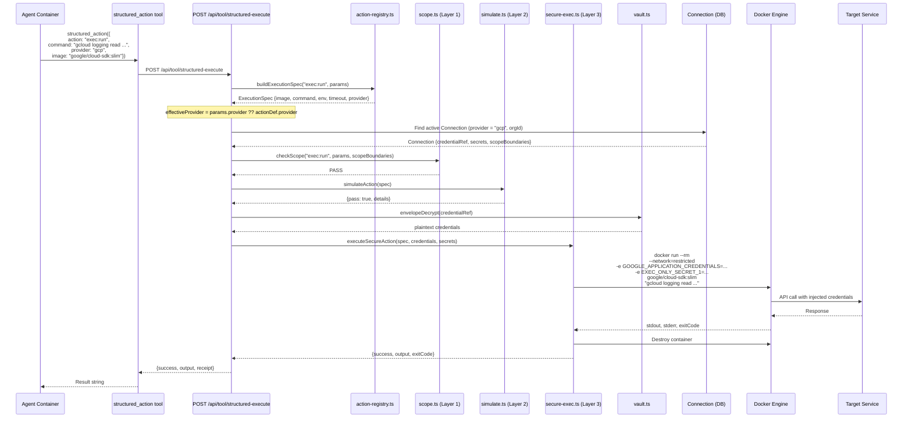
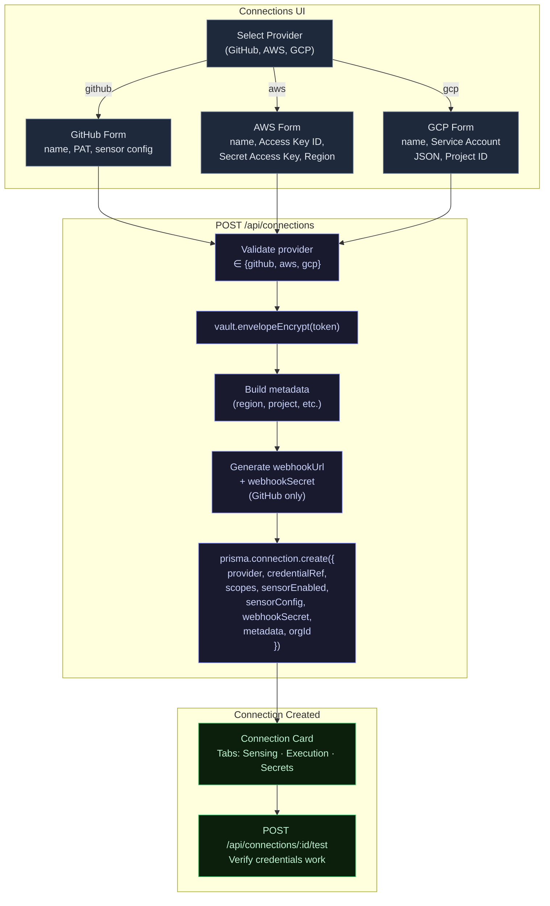

```mermaid
flowchart TB
    %% ────────────────────────────────────────────────────────────────────
    %% EXTERNAL SYSTEMS
    %% ────────────────────────────────────────────────────────────────────
    subgraph External["External Systems"]
        GH_WH["GitHub Webhooks<br/>(push, PR, check_run)"]
        GH_API["GitHub API<br/>(repos, PRs, checks)"]
        CLERK["Clerk Auth<br/>(JWT, Orgs, Webhooks)"]
        OPENAI["OpenAI API<br/>(gpt-4o-mini)"]
        BROWSER["User Browser<br/>(React SPA)"]
    end

    %% ────────────────────────────────────────────────────────────────────
    %% GATE API SERVER
    %% ────────────────────────────────────────────────────────────────────
    subgraph Gate["Gate API Server · apps/gate/ · Fastify"]

        subgraph MW["Middleware"]
            CLERK_AUTH["clerk-auth.ts<br/>JWT verification"]
            ORG_SCOPE["org-scope.ts<br/>Org isolation on all queries"]
            RATE_LIMIT["rate-limit.ts<br/>Per-IP + per-org"]
            SIG_AUTH["auth.ts<br/>Agent ed25519 signature"]
        end

        subgraph Routes["API Routes"]
            R_WEBHOOK["POST /api/webhooks/github/:connectionId<br/>routes/sensors.ts<br/>HMAC-SHA256 verified"]
            R_OPS["GET|POST /api/operations<br/>GET|PATCH /api/operations/:id<br/>POST .../route .../approve-routing"]
            R_RUNS["/api/runs CRUD<br/>POST .../transition .../kill<br/>GET .../events .../costs"]
            R_PROPOSALS["/api/proposals CRUD<br/>POST .../approve .../deny"]
            R_GATEWAY["POST /api/gateway/execute<br/>routes/gateway.ts<br/>Capability token required"]
            R_TOOL["POST /api/tool/structured-execute<br/>routes/tool.ts<br/>Agent structured_action endpoint"]
            R_CONN["GET /api/connections<br/>PATCH .../scope-boundaries<br/>GET /api/actions/available<br/>routes/connections.ts"]
            R_INST["/api/instances CRUD<br/>start/stop/restart/mission"]
            R_SSE["GET /api/events/stream<br/>routes/sse.ts<br/>Server-Sent Events (JWT auth)"]
            R_POLICIES["/api/policies CRUD<br/>presets, ai-optimize"]
            R_OTHER["insights, activity,<br/>audit, case-files,<br/>users, webhooks"]
        end

        subgraph Engines["Core Engines · engine/"]
            SENSOR["sensor.ts<br/>Sensor Engine<br/>Rule filter → dedup<br/>Extracts EventContext<br/>Creates Operation<br/>Suggests intent"]
            ROUTER["router.ts<br/>Agent Router<br/>AI intent classification<br/>LLM agent scoring<br/>Confidence thresholds"]
            ORCH["orchestrator.ts<br/>Run Orchestrator<br/>State machine<br/>Loop detection<br/>Timeout reaper"]
            RISK["risk.ts<br/>Risk Classifier<br/>Structural + AI layers<br/>READ / WRITE / DESTRUCTIVE"]
            POLICY["policy-eval.ts<br/>Policy Evaluator<br/>Evidence requirements<br/>Budget checks"]
        end

        subgraph Moat["Three-Layer Security Moat"]
            direction TB
            SCOPE["LAYER 1: scope.ts<br/>Scope Boundaries<br/>Per-action allowed/blocked patterns<br/>checkScope()"]
            SIM["LAYER 2: simulate.ts<br/>Pre-Execution Simulation<br/>DRY_RUN / DIFF_PREVIEW /<br/>API_CHECK / EVIDENCE_BUNDLE<br/>simulateAction()"]
            EXEC["LAYER 3: secure-exec.ts<br/>Ephemeral Container Execution<br/>Docker spawn → inject creds →<br/>run command → capture output →<br/>destroy container<br/>executeSecureAction()"]
        end

        subgraph Registry["Action Registry + Generic Exec"]
            ACTIONS["action-registry.ts<br/>Shortcuts: git:push, git:clone,<br/>github:pr:create, aws:s3:cp,<br/>gcp:cloudrun:deploy, etc.<br/>Generic: exec:run (any command<br/>+ provider + image override)<br/>→ ExecutionSpec"]
        end

        subgraph Security["Security Layer"]
            CAP["capability.ts<br/>Ed25519 signed tokens<br/>15-min TTL, scoped<br/>Key rotation via kid"]
            VAULT["vault.ts<br/>Envelope Encryption<br/>AES-256-GCM DEK/KEK"]
            WH_VERIFY["Webhook Verification<br/>HMAC-SHA256 (GitHub)<br/>Svix (Clerk)"]
        end

        subgraph AI["AI Services"]
            SUPERVISOR["ai-supervisor.ts<br/>Threat assessment<br/>Behavior analysis<br/>Contribution eval<br/>Session summary<br/>Role inference"]
        end

        subgraph Modules["Supporting Modules"]
            BUDGET["budget.ts + cost-attribution.ts<br/>Per-run budget, daily limits"]
            TRUST["trust.ts + contributions.ts<br/>0-100 trust score, trends"]
            EVIDENCE["evidence.ts + evidence-env.ts<br/>CI replay, structured diffs"]
            ROLLBACK["rollback.ts<br/>Compensating proposals"]
            EVENTS["events/bus.ts + run-events.ts<br/>WooblayEventBus → DB persist"]
        end

        subgraph Prompts["LLM Prompts · prompts/"]
            P_ROUTING["routing.ts"]
            P_RISK["risk-classification.ts"]
            P_POLICY["policy-optimizer.ts"]
            P_SUPER["supervisor.ts<br/>5 prompt builders"]
        end

        subgraph Types["Type Definitions · types/"]
            T_ACTIONS["actions.ts"]
            T_SCOPE["scope.ts"]
            T_SIM["simulation.ts"]
            T_EXEC["secure-exec.ts"]
            T_ROUTING["routing.ts"]
            T_SENSOR["sensor.ts"]
            T_RISK["risk.ts"]
            T_OTHER["evidence, budget, trust,<br/>capability, policy,<br/>rollback, supervisor"]
        end
    end

    %% ────────────────────────────────────────────────────────────────────
    %% DATA LAYER
    %% ────────────────────────────────────────────────────────────────────
    subgraph Data["PostgreSQL · Prisma ORM"]
        subgraph Models["Core Data Models"]
            M_OP["Operation<br/>(@@map Incident)<br/>title, priority, status,<br/>intent, suggestedIntent,<br/>eventContext, routing fields"]
            M_RUN["Run<br/>operationId, status,<br/>budgetCents, spentCents"]
            M_CONN["Connection<br/>provider (github/aws/gcp),<br/>token (encrypted), secrets<br/>(agent + exec_only modes),<br/>sensorEnabled, sensorConfig,<br/>scopeBoundaries, webhookSecret"]
            M_INST["Instance<br/>role, inferredRole,<br/>containerId, status"]
            M_PROP["Proposal<br/>riskClass, policySnapshot,<br/>evidence, approval"]
            M_CAP["Capability<br/>actionClass, scope,<br/>usedCount, maxUses, expiresAt"]
            M_EB["EvidenceBundle<br/>recipe, structuredDiff"]
            M_POLICY["PolicyRule<br/>matchTool, riskTier, decision"]
            M_COST["RunCost<br/>category, amountCents"]
            M_USER["User / Organization<br/>Clerk-synced"]
        end
    end

    %% ────────────────────────────────────────────────────────────────────
    %% AGENT CONTAINER
    %% ────────────────────────────────────────────────────────────────────
    subgraph Agent["Agent Container · Credential-Free (agent secrets as env vars)"]
        OPENCLAW["OpenClaw Runtime<br/>packages/adapters/openclaw/"]
        PLUGIN["openclaw-plugin/index.ts<br/>Tools: gated_exec, gated_write,<br/>gated_edit, gated_web_fetch (+ headers),<br/>structured_action (+ exec:run),<br/>list_secrets"]
        SOUL["SOUL.md / IDENTITY.md"]
        WS["Agent Workspace (filesystem)"]
        AGENT_ENV["Agent-accessible secrets<br/>injected as $ENV_VARS<br/>on container start"]
    end

    %% ────────────────────────────────────────────────────────────────────
    %% INFRASTRUCTURE
    %% ────────────────────────────────────────────────────────────────────
    subgraph Infra["AWS Infrastructure"]
        ALB["ALB / Route53<br/>TLS Termination"]
        EC2["EC2 Compute"]
        RDS["RDS PostgreSQL"]
        KMS["AWS KMS"]
        ECR["ECR Registry"]
        GH_CI["GitHub Actions CI/CD"]
    end

    %% ════════════════════════════════════════════════════════════════════
    %% CONNECTIONS / FLOWS
    %% ════════════════════════════════════════════════════════════════════

    %% External → Gate
    GH_WH -->|"webhook POST"| ALB
    BROWSER -->|"HTTPS"| ALB
    CLERK -->|"org/user webhook"| ALB
    ALB --> CLERK_AUTH
    CLERK_AUTH --> ORG_SCOPE --> RATE_LIMIT

    %% Webhook ingest → Sensor → Operation → Router → Run
    RATE_LIMIT --> R_WEBHOOK
    R_WEBHOOK --> WH_VERIFY
    R_WEBHOOK --> SENSOR
    SENSOR -->|"create Operation<br/>with EventContext"| M_OP
    SENSOR -->|"trigger routing"| ROUTER
    ROUTER -->|"LLM classify intent<br/>+ score agents"| OPENAI
    ROUTER -->|"read active instances"| M_INST
    ROUTER -->|"update routing fields"| M_OP
    ROUTER -->|"auto-create Run<br/>if confidence ≥ 0.7"| ORCH
    ORCH -->|"state transitions"| M_RUN

    %% Agent → structured_action → Gate Tool → Three-Layer Moat
    PLUGIN -->|"POST /api/tool/structured-execute<br/>{action, params}"| R_TOOL
    R_TOOL --> ACTIONS
    ACTIONS -->|"validate + build spec"| SCOPE
    SCOPE -->|"check allowed/blocked<br/>from Connection.scopeBoundaries"| SIM
    SIM -->|"dry-run in container<br/>or API preview"| EXEC
    EXEC -->|"resolve creds from vault"| VAULT
    VAULT -->|"decrypt DEK → plaintext token"| M_CONN
    EXEC -->|"docker run --rm<br/>inject creds as env vars<br/>network scoped<br/>workspace read-only"| GH_API
    EXEC -->|"capture stdout/stderr<br/>destroy container"| R_TOOL

    %% Gateway (legacy capability path)
    RATE_LIMIT --> R_GATEWAY
    R_GATEWAY --> CAP
    R_GATEWAY --> SCOPE
    OPENCLAW --> PLUGIN

    %% SSE real-time stream
    BROWSER -.->|"fetch() + ReadableStream<br/>JWT in Authorization header"| R_SSE
    EVENTS -.-> R_SSE

    %% User API routes
    RATE_LIMIT --> R_OPS & R_RUNS & R_PROPOSALS & R_CONN & R_INST & R_POLICIES & R_OTHER
    R_OPS --> M_OP
    R_RUNS --> ORCH
    R_PROPOSALS --> RISK
    RISK -->|"AI classification"| OPENAI
    R_PROPOSALS --> POLICY
    POLICY --> M_POLICY
    R_CONN --> M_CONN
    R_INST --> M_INST

    %% AI services
    SUPERVISOR -->|"async enrichment"| OPENAI
    ROUTER --> P_ROUTING
    RISK --> P_RISK
    SUPERVISOR --> P_SUPER

    %% Infrastructure
    EC2 --> RDS
    VAULT -.-> KMS

    %% ════════════════════════════════════════════════════════════════════
    %% STYLING
    %% ════════════════════════════════════════════════════════════════════

    classDef external fill:#1e293b,stroke:#64748b,color:#e2e8f0
    classDef middleware fill:#1e1e2e,stroke:#6366f1,color:#c7d2fe
    classDef route fill:#111827,stroke:#374151,color:#9ca3af
    classDef engine fill:#1a1a2e,stroke:#818cf8,color:#c7d2fe
    classDef moat fill:#0c1e0c,stroke:#22c55e,color:#bbf7d0,stroke-width:3px
    classDef security fill:#1a1a2e,stroke:#f59e0b,color:#fde68a
    classDef data fill:#1a1a2e,stroke:#10b981,color:#a7f3d0
    classDef agent fill:#1c1917,stroke:#f97316,color:#fed7aa
    classDef infra fill:#1e293b,stroke:#475569,color:#94a3b8
    classDef prompt fill:#1a1a2e,stroke:#a78bfa,color:#ddd6fe
    classDef typeDef fill:#1a1a2e,stroke:#475569,color:#9ca3af

    class GH_WH,GH_API,CLERK,OPENAI,BROWSER external
    class CLERK_AUTH,ORG_SCOPE,RATE_LIMIT,SIG_AUTH middleware
    class R_WEBHOOK,R_OPS,R_RUNS,R_PROPOSALS,R_GATEWAY,R_TOOL,R_CONN,R_INST,R_SSE,R_POLICIES,R_OTHER route
    class SENSOR,ROUTER,ORCH,RISK,POLICY engine
    class SCOPE,SIM,EXEC moat
    class CAP,VAULT,WH_VERIFY security
    class M_OP,M_RUN,M_CONN,M_INST,M_PROP,M_CAP,M_EB,M_POLICY,M_COST,M_USER data
    class OPENCLAW,PLUGIN,SOUL,WS,AGENT_ENV agent
    class ALB,EC2,RDS,KMS,ECR,GH_CI infra
    class P_ROUTING,P_RISK,P_POLICY,P_SUPER prompt
    class T_ACTIONS,T_SCOPE,T_SIM,T_EXEC,T_ROUTING,T_SENSOR,T_RISK,T_OTHER typeDef
    class BUDGET,TRUST,EVIDENCE,ROLLBACK,EVENTS engine
    class ACTIONS engine
    class SUPERVISOR engine
```

# Wooblay — Technical Architecture Diagram (Miro-Ready)

Single comprehensive Mermaid diagram covering the full Wooblay system architecture.
Paste into Miro's Mermaid widget for instant visual reproduction.

---



---

## Key Architectural Highlights

### Three-Layer Security Moat (green nodes)

Every credentialed action passes through all three layers sequentially:

1. **Scope Boundaries** (`scope.ts`) — Per-connection `allowed`/`blocked` patterns. Example: `git:push` allowed only to `feature/*` branches, blocked from `main`.
2. **Pre-Execution Simulation** (`simulate.ts`) — Dry-run the action in an ephemeral container before real execution. Strategies: `DRY_RUN`, `DIFF_PREVIEW`, `API_CHECK`, `EVIDENCE_BUNDLE`.
3. **Secure Execution** (`secure-exec.ts`) — Spin up a short-lived Docker container, inject credentials as env vars (resolved from encrypted vault), execute the deterministic command from the action registry, capture output, destroy the container. **The agent never sees credentials.**

### Agent Credential Isolation + Two-Mode Secrets

- Agent containers have **zero provider credentials** (GitHub PAT, AWS Secret Key, GCP service account).
- **Agent-accessible secrets** (`mode: "agent"`) are injected as env vars on agent container start. These are user-defined keys for lightweight operations (API testing, DB queries).
- **Exec-only secrets** (`mode: "exec_only"`) are injected only into ephemeral execution containers — the agent never sees them. For sensitive deploy credentials.
- Provider credentials are always exec-only by design.
- The `list_secrets` tool lets agents discover available secrets and their modes.

### Generic Execution (exec:run)

- Agents are NOT limited to the 10 registered shortcuts. `exec:run` runs any command in a secure ephemeral container with provider creds + exec_only secrets.
- Agents specify: `command`, `provider` (which creds to inject), `image` (Docker image), `timeout`.
- Still goes through all three moat layers.

### Connection Model (Dual-Role, Multi-Provider)

Each `Connection` serves two purposes:
- **Sensing**: Webhook ingestion, `sensorConfig` (event filters, branch rules), sensor toggle (GitHub)
- **Execution**: Provides credentials for the three-layer moat, `scopeBoundaries` for fine-grained control
- **Providers**: GitHub (PAT), AWS (Access Key + Secret Key + Region), GCP (Service Account JSON + Project)
- **Secrets**: Per-connection key-value pairs with agent/exec_only visibility toggle

### Real-Time Observability

- `GET /api/events/stream` — SSE endpoint using `fetch()` + `ReadableStream` with JWT authentication
- Events emitted at every moat layer: `scope_check`, `simulation_start`, `simulation_complete`, `secure_exec_start`, `secure_exec_complete`

---

## Diagram 2: Secret Flow — Agent vs Exec-Only

Shows how user-defined secrets flow through the system depending on their visibility mode.

```mermaid
flowchart LR
    subgraph User["User (Connections UI)"]
        ADD_SECRET["Add Secret<br/>key: API_KEY<br/>value: sk-xxx<br/>mode: agent | exec_only"]
    end

    subgraph Gate["Gate API"]
        ENCRYPT["vault.ts<br/>AES-256-GCM encrypt"]
        STORE["Connection.secrets<br/>(encrypted JSON array)"]
    end

    subgraph AgentStart["Agent Container Start"]
        RESOLVE_AGENT["resolveAgentSecrets()<br/>secure-exec.ts"]
        DOCKER_CREATE["docker create<br/>-e API_KEY=sk-xxx"]
        AGENT_ENV["Agent Process<br/>$API_KEY available"]
    end

    subgraph ExecRun["Ephemeral Execution (exec:run / structured_action)"]
        RESOLVE_EXEC["resolveCredentials()<br/>secure-exec.ts"]
        EPHEMERAL["docker run --rm<br/>-e API_KEY=sk-xxx<br/>-e DEPLOY_KEY=dk-yyy<br/>-e GITHUB_TOKEN=ghp-zzz"]
        DESTROY["Container destroyed<br/>secrets gone"]
    end

    ADD_SECRET -->|"POST /api/connections/:id/secrets"| ENCRYPT
    ENCRYPT --> STORE

    STORE -->|"mode = agent"| RESOLVE_AGENT
    RESOLVE_AGENT --> DOCKER_CREATE --> AGENT_ENV

    STORE -->|"mode = agent OR exec_only"| RESOLVE_EXEC
    RESOLVE_EXEC --> EPHEMERAL --> DESTROY

    AGENT_ENV -.->|"$API_KEY in gated_exec,<br/>gated_web_fetch headers"| AGENT_ENV

    classDef user fill:#1e293b,stroke:#64748b,color:#e2e8f0
    classDef gate fill:#1a1a2e,stroke:#818cf8,color:#c7d2fe
    classDef agent fill:#1c1917,stroke:#f97316,color:#fed7aa
    classDef exec fill:#0c1e0c,stroke:#22c55e,color:#bbf7d0,stroke-width:2px

    class ADD_SECRET user
    class ENCRYPT,STORE gate
    class RESOLVE_AGENT,DOCKER_CREATE,AGENT_ENV agent
    class RESOLVE_EXEC,EPHEMERAL,DESTROY exec
```



**Key rules:**
- `agent` mode secrets → injected into agent container on start + ephemeral containers
- `exec_only` mode secrets → injected ONLY into ephemeral containers (agent never sees value)
- Provider credentials (GitHub PAT, AWS keys, GCP SA) → always exec-only by design
- `list_secrets` tool → agent sees names + modes, never decrypted values of exec_only secrets

---

## Diagram 3: exec:run Lifecycle — Generic Secure Execution

Full lifecycle of an `exec:run` structured action from agent request to completion.



**Key properties:**
- Provider is dynamic: `params.provider` overrides default
- Image is dynamic: `params.image` overrides default `node:20-slim`
- All three moat layers still apply (scope → simulation → ephemeral execution)
- Container is destroyed immediately after execution
- Credentials are never returned to the agent — only stdout/stderr/exitCode

---

## Diagram 4: Connection Creation Flow

How connections are created across different providers.



**Provider-specific details:**
- **GitHub**: Token is a PAT. Sensor config enables webhook-based event detection. `webhookUrl` and `webhookSecret` are auto-generated.
- **AWS**: Access Key ID stored as token, Secret Access Key + Region in metadata. Default scopes: `['*']`.
- **GCP**: Service Account JSON stored as token, Project ID in metadata. Default scopes: `['*']`.

---

## How to Use in Miro

1. **Add Mermaid widget**: In Miro, click `+` → Apps → search "Mermaid" → add widget
2. **Paste**: Copy content between the ` ```mermaid ` and ` ``` ` markers
3. **Color legend**:
   - **Purple/Indigo**: Middleware, engines, core logic
   - **Green (thick border)**: Three-layer security moat
   - **Yellow/Amber**: Security primitives (tokens, encryption, verification)
   - **Green (thin)**: Data models
   - **Orange**: Agent container
   - **Grey**: Infrastructure, routes
